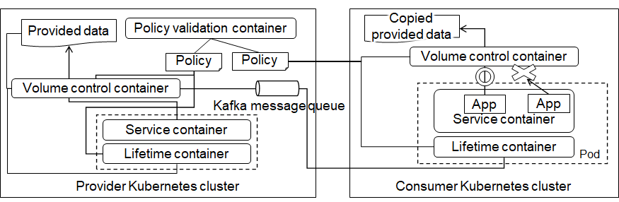

# Data sharing controllers on *Kubernetes*

## Overview

Data sharing controllers manage shared data, i.e. provided data, according to sharing policies, on single and multiple Kubernetes clusters.  This enables data providers and consumers to release from the cumbersome and error-prone management tasks.  The controllers present the following three functionalities.

1. Updating continuously copied provided data and deleting them at the expiry date.

1. Deleting derived data as well as origins of provided data

1. Controlling accesses to provided data at the granularity of application programs



## Requirements
- *Kubernetes*
  - Custom resource definitions for the data lifetime controller are registered in a *Kubernetes* cluster.
- *Docker engine*
  - Client code for *Kubernetes* custom resource APIs is generated by [the code generator][codegen] in a *docker* container.
  - Client code for *gRPC* APIs is generated in a *docker* container.
  - Test code is run in a *docker* container.
- *Docker registry*
  - The *docker* images including generated executables, the data lifetime controller, the volume controller and its client, and the lifetime validator are stored in this *registry*.\
    Set the environment variable `${DOCKER_REGISTRY}` if you use your private *docker* registry.
- [*Apache Kafka*][kafka]
  - Shared data are transferred from providers to consumers through message queues.

## Creating quickly the *docker* images including data sharing controllers
```
$ make
```

## Creating the *docker* images including the controllers using customized *Kubernetes* custom resource code

```
$ make cr-codegen
$ make
```

Give the `${CODEGEN_BUILD_CACHE}` environment variable if you would like to generate the *docker* image including the client code generator only the first time this command is issued.
```
$ CODEGEN_BUILD_CACHE=true make cr-codegen
$ make
```

## Creating the *docker* images including the controllers using customized *gRPC* code

```
$ make grpc-codegen
$ make
```

Give the `${CODEGEN_BUILD_CACHE}` environment variable if you would like to generate the *docker* image including the client code generator only the first time this command is issued.
```
$ CODEGEN_BUILD_CACHE=true make grpc-codegen
$ make
```

## Creating CSI driver images for the volume controller

Refer to the [`artifacts/csi_drivers`][csi-drivers] directory.


## Running the controllers on *Kubernetes*

Refer to the steps until the data sharing controllers start managing a data lifetime using example data under the [`artifacts/examples`][examples] directory.
 
## Carrying out test cases for the source code

The *Kafka* instance is required to run test cases.  You need to launch the containerized instance provided by the [*kafka-go*][kafka-go] library in advance as described [here][kafka-go-test].
```
docker-compose up -d
```

Use the variable `${TFLAGS}` if you would like to give `go test` arguments, such as `-v` and `-short`, as follows.
```
$ TFLAGS="[test flags]" make test
```

Use the variable `${GO_TEST}` if you would like to run each test case as follows.
```
$ GO_TEST="go test ([build/test flags]) [package name] -run [test name]" make test
```

## Cleaning up the source code tree

Run the following command to delete the executables.
```
$ make clean
```

Run the following command to delete all the generated files including the executables, the client codes generated by the code generators, and *docker* images.
```
$ make distclean
```


[codegen]: https://github.com/kubernetes/code-generator
[kafka]: https://kafka.apache.org/
[csi-drivers]: artifacts/csi_drivers
[examples]: artifacts/examples
[kafka-go]: https://github.com/segmentio/kafka-go
[kafka-go-test]: https://github.com/segmentio/kafka-go#testing


# Contact
contact-dscok@cs.jp.fujitsu.com
