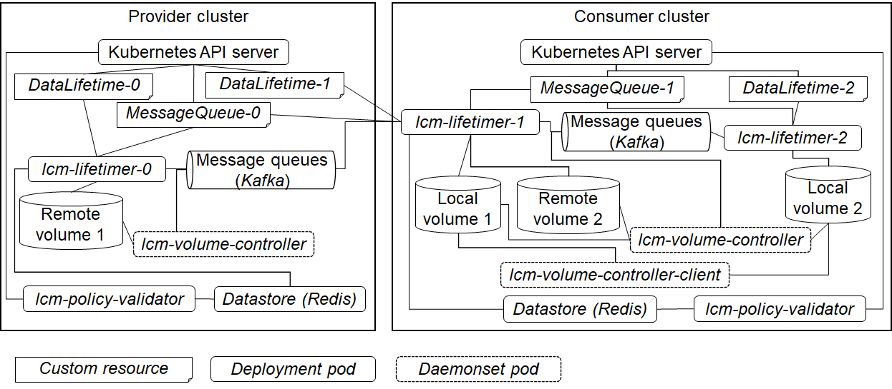

## Running the data sharing controllers on *Kubernetes*

The following diagram represents overall deployment after the below step 19.


1. Register the custom resource definitions at the *Kubernetes* cluster which stores the target data.  This cluster is called a *provider cluster*.
   ```
   kubectl apply -k kustomize/crd
   ```

1. Create the `dsc` namespace at the *provider cluster*.
   ```
   kubectl apply -k kustomize/namespace
   ```

1. Deploy the *lifetime validator* on the *provider cluster*.\
   The *lifetime validator* is an instance of the [validating admission controller][admission].  First, the data store server is launched to retain *lifetime* caches utilized by the *lifetime validator*.
   ```
   kubectl apply -k kustomize/datastore
   ```
   Next, the below script generates the private key and the self-signed TLS certificate used by the *lifetime validator*. Furthermore, the generated TLS certificate is added to the *provider cluster*.
   ```
   hack/validator_secret.sh generate
   ```
   Then, you need to register the *validation admission webhook* and run the *lifetime validator*.  The docker image with the *lifetime validator*, `shadowy-policy-validator`, needs to be given `newName` in the `kustomization.yaml` under the [`kustomize/admission/validation/base`][kustomize-validation] directory.
   ```
   kubectl apply -k kustomize/admission/validation/overlays
   ```

1. Register the custom resource definitions and the `dsc` namespace at the *consumer cluster* if the *consumer cluster* is different from *provider cluster*, i.e., the case of using multiple *Kubernetes* clusters.
   ```
   kubectl apply -k kustomize/crd
   kubectl apply -k kustomize/namespace
   ```

1. Deploy the *volume* controllers on the *provider cluster*.\
   The docker images with the *volume* controller, `shadowy-volume-controller`, need to be given `newName` in the `kustomization.yaml` under the [`kustomize/controller/volume_control`][kustomize-volume-control] directory.
   ```
   kubectl apply -k kustomize/controller/volume_control
   ```

1. Register the custom resource instances in which the *lifetime* for original provided data and the configuration of the *message queues* are specified at the *provider cluster*.\
   In the *lifetime* custom resource, you can specify one lifetime configuration, including names of target persistent volume claims, and executables permitted to access data for each target volume in `lifetime.yaml` under the [`kustomize/custom_resouce/provider0`][kustomize-lifetimer-0] directory.  With regard to the custom resource for the message queuing system running on the *provider cluster*, the broker addresses, a user name for the SASL/SCRAM authentication and the corresponding password need to be required in `message_queue.yaml` and `secret.yaml` under the [`kustomize/custom_resouce/consumer0`][kustomize-mqconfig-0] directory, respectively.  See [details of the custom resources for the life cycle controller][lifecycle-cr] and [the custom resource for a message queue][message-queue-cr].
   ```
   kubectl apply -k kustomize/custom_resource/provider0
   kubectl apply -k kustomize/custom_resource/consumer0
   ```

1. If the RBAC authentication is enabled in the *provider cluster*, you need to register the service account for the *lifetime* controller running on the cluster, the role, and the role binding for the controller. 
   ```
   kubectl apply -k kustomize/rbac/provider0
   kubectl apply -k kustomize/rbac/consumer0
   ```

1. Prepare the [persistent volume][persistent] for original provided data and its claim at the *provider cluster*.\
   The claim named `remote-vol-1` is required for this example. This persistent volume is used as input data of the first *lifetime* controller.  As described [here][volume-control], you need to add the volume-control labels, `csi.volumes.dsc.io/usagecontrol: "true"` and `csi.volumes.dsc.io/mqpublish: "true"`, to `labels` in the claim for a [CSI volume][csi-volume].

1. Deploy the first *lifetime* controller for original provided data on the *consumer cluster*.
   ```
   kubectl apply -k kustomize/controller/lifetimes0/overlays
   ```
   The *data container* including the data lifetime controller runs with the *service container* in one pod instance.  Files under the `/tmp/target1` directory are exported to the message queue when you create, update, or delete them in the *service container*.\
   You need to give `newName`, the name of the docker image including the lifetime controller executable, `shadowy-lifetimer`, in the `kustomization.yaml` under the [`kustomize/controller/lifetimes0/overlays`][kustomize-lifetime-0] directory.\
   To expose names of the *lifetime* custom resources to each *data container*, the `K8S_LIFETIMES_NAMES` environment variable needs to be given in the controller configuration, `deployment.yaml`, under the [`kustomize/controller/lifetimes0/overlays`][kustomize-lifetime-0] directory.  Refer to [this page][k8s-lifetimes-env] for the detail.

1. Deploy the *lifetime validator* on the *consumer cluster* for the case of multiple clusters.
   ```
   kubectl apply -k kustomize/datastore
   hack/validator_secret.sh generate
   kubectl apply -k kustomize/admission/validation/overlays
   ```

1. Deploy the *volume* controllers and their clients for each *Kubernetes* node on the *consumer cluster*.\
   The docker images with the *volume* controller, `shadowy-volume-controller`, and its client, `shadowy-volumectl`, respectively need to be given `newName` in the `kustomization.yaml` under the [`kustomize/controller/volume_control`][kustomize-volume-control] directory and `newName` in the `kustomization.yaml` under the [`kustomize/client/volume_control`][kustomize-volume-client] directory.
   ```
   kubectl apply -k kustomize/controller/volume_control
   kubectl apply -k kustomize/client/volume_control
   ```

1. Prepare the [persistent volume][persistent] for output data of the second *lifetime* controller and its claim at the *consumer cluster*.\
   The claim named `remote-vol-2` is required for this example. This persistent volume is used as input data of the third *lifetime* controller.  As with `remote-vol-1`, labels for volume control need to be added to the CSI volume claim, `remote-vol-2`.

1. Prepare the [*local* persistent volumes][local-volume] with the `local-vol-1` volume claim for the second *lifetime* controller and the `local-vol-2` volume claim for the third *lifetime* controller at the *consumer cluster*.  You can use the [static provisioner for the *local* persistent volumes][local-provisioner] to create a local persistent volume.  For the volume control, a pathname in the persistent volume must be a mount point for the *FUSE* file system.  To create the *FUSE* mount point, you issue the `shadowy-volumectl` command described [here][volume-control] in the *volume* controller client running on one of the *Kubernetes* nodes.
   ```
   shadowy-volumectl init --volume-source-path /mnt/fuse/sources/local/vol1 --fuse-mounts-host-root-directory /mnt/fuse/targets --external-allowed-executables "[{\"command_absolute_path\": \"/usr/bin/kubelet\", \"is_host_process\": true, \"are_all_processes_allowed_in_namespace\": true, \"writable\": true}(,{\"command_absolute_path\":\"/local-provisioner\", \"writable\": true},...)]"
   shadowy-volumectl init --volume-source-path /mnt/fuse/sources/local/vol2 --fuse-mounts-host-root-directory /mnt/fuse/targets --external-allowed-executables "[{\"command_absolute_path\": \"/usr/bin/kubelet\", \"is_host_process\": true, \"are_all_processes_allowed_in_namespace\": true, \"writable\": true}(,{\"command_absolute_path\":\"/local-provisioner\", \"writable\": true},...)]"
   ```
   `/mnt/fuse/sources/local/vol1` and `/mnt/fuse/sources/local/vol2` are *FUSE* source directories under which provided data are stored for `local-vol-1` and `local-vol-2`, respectively.  `/mnt/fuse/targets` is a root directory under which *FUSE* mount points are created.  You need to create `/mnt/fuse/sources/local/vol1`, `/mnt/fuse/sources/local/vol2`, and `/mnt/fuse/targets` if these three directories do not exist.  The `external-allowed-executables` option enables specified executable instances to manipulate provided data in the FUSE mount point. For example, the *Kubelet* executable must be specified because *Kubelet* mounts the FUSE mount point into containers.  Refer to [this page][external-allowed-executables] for the `external-allowed-executables` details.  One of the return values, a *FUSE* mount point path, is used at the FUSE unmount processing.

1. Register the second custom resource instances stored in the [`kustomize/custom_resouce/provider1`][kustomize-lifetimer-1] and [`kustomize/custom_resouce/consumer1`][kustomize-mqconfig-1] directories, and the third custom resource instance stored in the [`kustomize/custom_resouce/provider2`][kustomize-lifetimer-2] directory at the *provider cluster*.
   ```
   kubectl apply -k kustomize/custom_resource/provider1
   kubectl apply -k kustomize/custom_resource/consumer1 
   kubectl apply -k kustomize/custom_resource/provider2
   ```
   In common with the above step 6, you specify the lifetime configurations in the `provider1` and `provider2` directories while specifying the configuration for the message queuing system running on the *consumer cluster* in the `consumer1` directory.

1. Create a configuration file to access the *provider cluster*, called *kubeconfig*, from another *Kubernetes* cluster called *consumer cluster* on the master node at the *provider cluster* in the case of using multiple *Kubernetes* clusters.
   ```
   hack/user_account.sh generate [user name] [API server URL]
   ```
   This script creates the user account for the controllers, the *lifetime* controller, and the *volume* controller, using the *openssl* command and adds it to the *kubeconfig* file named `config`.  The *kubeconfig* is put under the `/tmp/k8s_user_account` directory by default.  If you would like to change the output directory for *kubeconfig*, you need to specify the `OUTPUT_DIR` environment variable.

1. If the RBAC authentication is enabled in the *provider cluster*, you need to register the account for the second *lifetime* controller running on the *consumer cluster*, the role, and the role binding for the controller.  A registered account is the service account in the case of a single cluster while the user account in the case of multiple clusters.\
   For a single cluster, execute a command to register the RBAC authentication for the *provider cluster* as follows.
   ```
   kubectl apply -k kustomize/rbac/provider1/single_cluster
   ```
   For multiple clusters, you need to fill out the name of the user account in `user_rolebinding.yaml` under the [`kustomize/rbac/provider1/multi_clusters`][kustomize-rbac-provider-1] directory and then issue the following command.
   ```
   kubectl apply -k kustomize/rbac/provider1/multi_clusters
   ```

1. If the RBAC authentication is enabled in the *consumer cluster*, you need to register the service accounts, the roles, and the role bindings for the second *lifetime* controller.
   ```
   kubectl apply -k kustomize/rbac/consumer1
   ```

1. Deploy the the second *lifetime* controller on the *consumer cluster*.
   For a single cluster, `newName`, the name of the docker image including the lifetime controller executable, `shadowy-lifetimer`, is required in the `kustomization.yaml` the under [`kustomize/controller/lifetimes1/overlays/single_cluster`][kustomize-lifetime-1-single] directory.  To expose names of the *lifetime* custom resources to each *data container*, the `K8S_LIFETIMES_NAMES` environment variable needs to be given in the controller configuration, `deployment.yaml`, under the same directory.  Afterward, you execute the following command.
   ```
   kubectl apply -k kustomize/controller/lifetimes1/overlays/single_cluster
   ```
   For the multiple clusters, the name of the docker image is given to `newName` in `kustomization.yaml` under [`kustomize/controller/lifetimes1/overlays/multi_clusters`][kustomize-lifetime-1-multiple].  Like the case of using a single cluster, names of the *lifetime* custom resources are given to `K8S_LIFETIMES_NAMES` in `deployment.yaml` under the [`kustomize/controller/lifetimes1/overlays/multi_clusters`][kustomize-lifetime-1-multiple] directory.  Additionally, you need to create the persistent volume claim named `kubeconfig-vol-1` and add *kubveconfig* created at the above step 15 to the corresponding persistent volume.  Then, execute the following command.
   ```
   kubectl apply -k kustomize/controller/lifetimes1/overlays/multi_clusters
   ```

1. Similarly to the second *lifetime* controller, deploy the third *lifetime* controller on the *consumer cluster*.
   ```
   kubectl apply -k kustomize/controller/lifetimes2/overlays
   ```

1.  Clearing the setting for the volume control including unmounting the *FUSE* mount points for `local-vol-1` and `local-vol-2` in the *consumer cluster* after deleting the *lifetime* controllers.
   ```
   shadowy-volumectl final --fuse-mount-point-path /mnt/fuse/targets/local/vol1
   shadowy-volumectl final --fuse-mount-point-path /mnt/fuse/targets/local/vol2
   ```
   

[persistent]: https://kubernetes.io/docs/concepts/storage/persistent-volumes/
[admission]: https://kubernetes.io/docs/reference/access-authn-authz/extensible-admission-controllers/#admission-webhooks
[kustomize-validation]: ../kustomize/admission/validation/base
[kustomize-volume-control]: ../kustomize/controller/volume_control
[kustomize-volume-client]: ../kustomize/client/volume_control
[csi-volume]: https://kubernetes.io/docs/concepts/storage/volumes/#csi
[service-wo-selector]: https://kubernetes.io/docs/concepts/services-networking/service/#services-without-selectors
[local-volume]: https://kubernetes.io/docs/concepts/storage/volumes/#local
[kustomize-lifetimer-0]: ../kustomize/custom_resource/provider0
[kustomize-lifetimer-1]: ../kustomize/custom_resource/provider1
[kustomize-lifetimer-2]: ../kustomize/custom_resource/provider2
[kustomize-mqconfig-0]: ../kustomize/custom_resource/consumer0
[kustomize-mqconfig-1]: ../kustomize/custom_resource/consumer1
[lifecycle-cr]: ../../../docs/custom_resources.md
[message-queue-cr]: ../../../docs/message_queues.md
[volume-control]: ../../../docs/volume_control.md
[local-provisioner]: https://github.com/kubernetes-sigs/sig-storage-local-static-provisioner
[external-allowed-executables]: ../../../docs/external_allowed_executables.md
[kustomize-volume]: ../kustomize/volume
[kustomize-rbac-provider-1]: ../kustomize/rbac/provider1/multi_clusters
[kustomize-lifetime-0]: ../kustomize/controller/lifetimes0/overlays
[kustomize-lifetime-1-single]: ../kustomize/controller/lifetimes1/overlays/single_cluster
[kustomize-lifetime-1-multiple]: ../kustomize/controller/lifetimes1/overlays/multi_clusters
[kustomize-lifetime-2]: ../kustomize/controller/lifetimes1/overlays
[k8s-lifetimes-env]: ../../../docs/k8s_lifetimes_names.md
